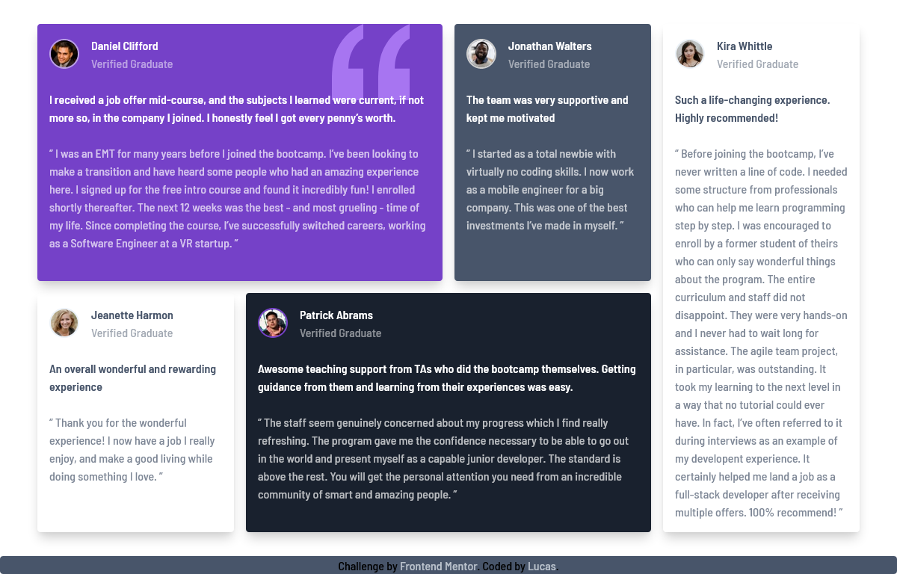

# Frontend Mentor - Testimonials grid section solution

This is a solution to the [Testimonials grid section challenge on Frontend Mentor](https://www.frontendmentor.io/challenges/testimonials-grid-section-Nnw6J7Un7). Frontend Mentor challenges help you improve your coding skills by building realistic projects. 

## Table of contents
  - [The challenge](#the-challenge)
  - [Screenshots](#screenshots)
  - [Links](#links)
  - [Built with](#built-with)
  - [Useful resources](#useful-resources)
- [Author](#author)

### The challenge

Users should be able to:

- View the optimal layout for the site depending on their device's screen size

### Screenshots

### Links

- Solution URL: [GitHub](https://github.com/lucas26a/testimonials-grid-section)
- Live Site URL: [Netlify](https://lucas26a-testimonialsgridsection)

### Built with

- Semantic HTML5 markup
- CSS custom properties
- Flexbox
- CSS Grid
- Mobile-first workflow
- [Tailwind CSS](https://tailwindcss.com/) - For styles

### Useful resources

- [learn CSS Grid the easy way](https://www.youtube.com/watch?v=rg7Fvvl3taU&t=1698s) - Kevin Powell talks about CSS Grid.

## Author

- Website - [GitHub](https://github.com/lucas26a/)
- Frontend Mentor - [@yourusername](https://www.frontendmentor.io/profile/lucas26a/)
<!-- - Twitter - [@lucas26almeida](https://www.twitter.com/lucas26almeida) -->
